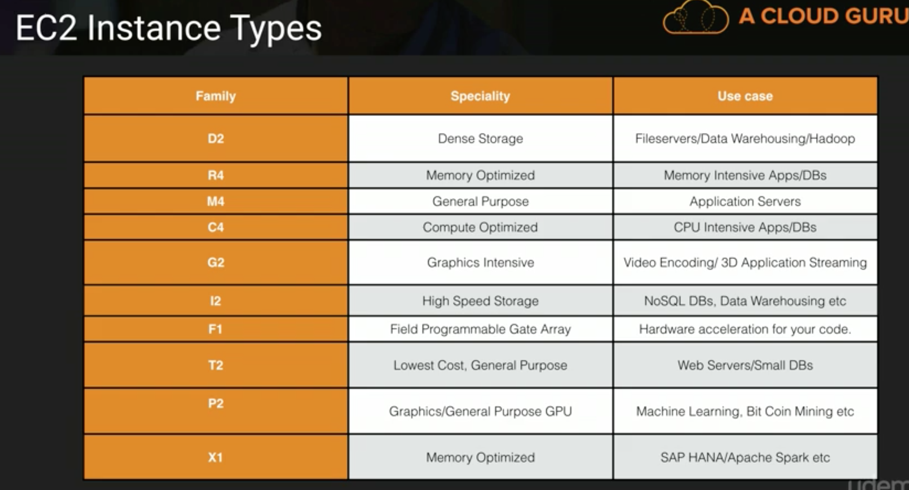

# Elastic Cloud Compute - EC2

- Web service that provides resizable compute capacity in the cloud.

- i.e. Virtual Machines in the cloud.

- Pay only for capacity that you use.

- Types:

  - __On demand__: pay by the minute/second no commitement
    - Low cost
    - Flexible
    - Uninterupable
    - Prototyping
    - Most popular
  - __Reserved__: Capacity reservation. Cheaper than above. 1 - 3 year terms.
    - Steady state
    - Predicable usage
    - Reserved capacity
    - Upfront payments reduce cost
    - Types:
      - Standard RI (75% off on demand)
      - Convertible RI (54% off on demand)
      - Scheduled RIs - allows you to launch for specific time windows for peak demand.
  - __Spot__: bid price based on supply/demand. Useful if App has flexible start/end times.
    - Flexible start and end times
    - Apps that are only feasible at low compute prices
  - __Dedicated Host__: Physical EC2 dedicated.
    - Regulatory requirement
    - Where multi tennant isn't wanted.

  ​

  ## EC2 Instance types

  

- Dr Mc Gift PX

  D - Density

  R - RAM

  M - General Purpose

  G - Graphics

  I - Iops

  F - FPGA

  T - general purpose (cheap)

  P - General purpose graphics

  X - Exreme Memory

# EBS - Elastic Block Storage

- Discs that can be attached to EC2 VMs.

- Suitable for filesystems/dbs etc.

- Automatically replicated to same availability zone.

- Types:

  - General Purpose SSD (SP2)
    - Balance between performance and price.
    - Configurable IOPS
  - Provisioned IOPS SSD (I01)
    - Designed for IOPS intensive operations i.e. dbs. 
    - 10000+ IOPS
  - Throughput Optimised HDD (ST1)
    - Big data
    - Data warehouse
    - Log processing
    - Sequential data
    - Cannot be a boot volume
  - Cold HDD (SC1)
    - Fileservers
    - Low cost storage for infrequently used data.
    - Cannot be boot volume.
  - Magnetic Standard
    - Can be a boot volume
    - Data is accessed infrequently.
    - Low cost important.

  # Topics

  ## Lab

  1. Launching an EC2 instance
  2. Security Group basics
  3. Volumes and snapshots
  4. Create an AMI
  5. Load balancers and helath checks
  6. Cloud watchAWS Command line.
  7. IAM Roles with EC2
  8. Bootstrap scripts
  9. Launch configuration groups
  10. Autoscaling 101
  11. Elastic File System (EFS)
  12. Lamba Concepts
  13. Serverless webpage with Lamba and API Gateway
  14. Build a serverless website with Polly
  15. Build an Alexa skill

  ​

  ## Exam Tips

  - Know the differences between pricing models for EC2 servers
    - On demand
    - Spot (self terminated - pay by the hour; AWS terminated they pay the hour)
    - Reserved
    - Dedicated
  - EBS consists of:
    - SSD General Purpose - GP2 - Up to 10000 IOPS
    - SSD Provisioned IOPS - I01 - 10000+ IOPS 
    - HDD Throughput Optimized (ST1)
    - Cold HDD (SC1)
    - Magnetic Standard
  - EBS volumes can be attached to only one EC2 instance.
  - Use cases for EC2 instance types (above)
  - ​