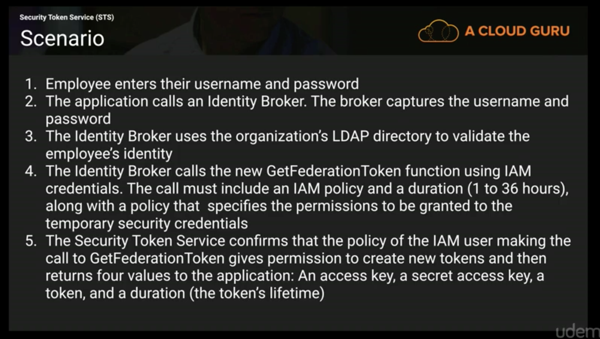
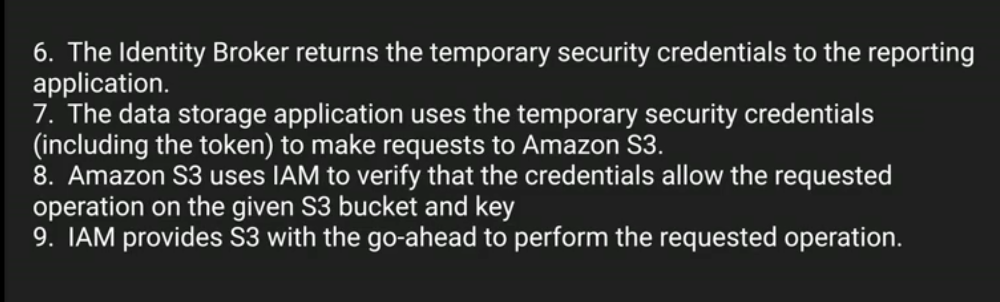
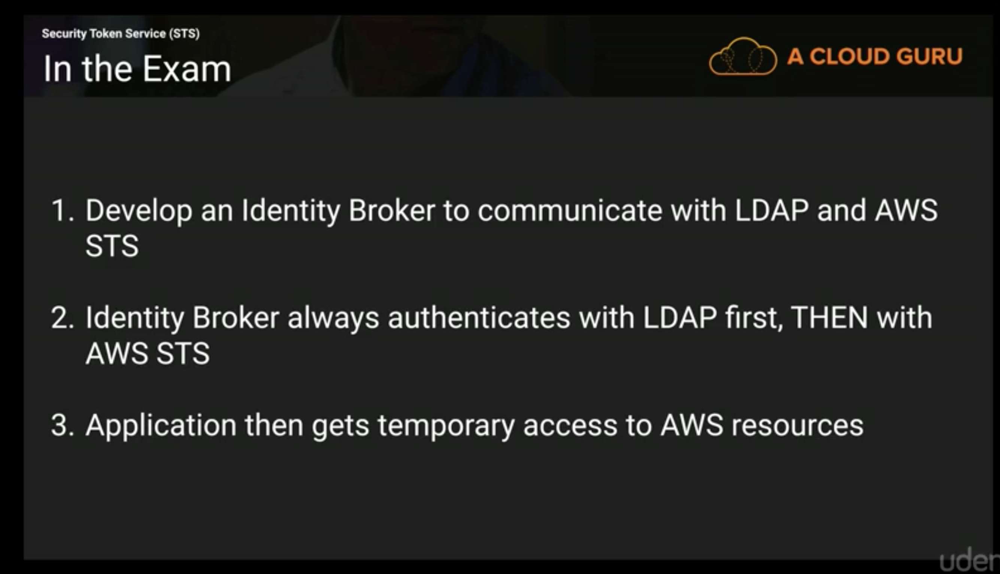

# Security Token Service (STS)

- Grants users limited and temporary accessto AWS resources. Requests can come for one of one of three sources:
  1. Federation (combining a list of users in one domain i.e. IAM with another i.e. ActiveDirectory):
     - Using SAML (Security access markup language).
     - Via ActiveDirectory.
     - Single Sign on.
  2. Federation with Mobile Apps:
     - OpenID providers such as Google/Facebook/Amazon
  3. Cross Account Resources:
     - Allows users from pone AWS account access others.
- Identity Broker - a service that allows you to take an identity from point A and join it (federate it) with point B.
- Identity Store: Services like ActiveDirectory, Facebook, Google etc.
- identities: users of a service.

This can be broadly broken down into the following 3 steps:

